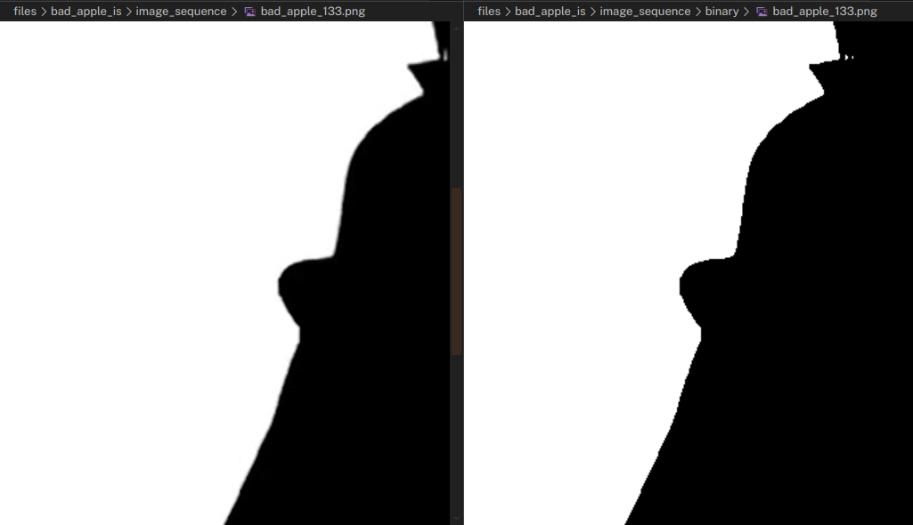
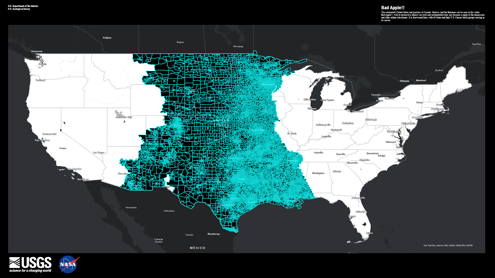

# ArcApple!!
A project for coloring an ArcGIS feature layer based on a raster layer.
All code files are located in the `scripts` folder.
## Why?
It's fun! And I think that programming within a number of limitations can work as a great test of one's ability. Having a playground with unlimited resources can be fun and all, but having a set goal in a constrained environment can be where true innovation lies; and while I could have done this far more easily using some After Effects trickery, it's more fun to both work in a constrained environment, where I can show off my skills and hopefully contribute to one of my favorite sides of [online culture](https://en.wikipedia.org/wiki/Bad_Apple!!#Usages_in_meme_culture).
## How?
### 1: Get the data
I created a copy of the Block_Group TIGER shapefile from the [*National Sub-State Geography Geodatabase* data product](https://www.census.gov/geographies/mapping-files/time-series/geo/tiger-geodatabase-file.2023.html), and filtered it to only contain Census block groups for the contiguous United States.
   - This entailed the removal of blocks outside the contiguous U.S. and the removal of blocks where `ALAND = 0` (i.e., blocks with only water bodies)
   - My final census block group layer was then exported using the "Export Features" geoprocessing tool, which exported the layer into its own geodatabase.
The frames and audio from the original Bad Apple!! music video were pulled [from the Internet Archive](https://archive.org/details/bad_apple_is.7z), where an uploader graciously uploaded the video and audio in PNG and WAV formats, respectively.
### 2: Georeference the frames
I then georeferenced very frame of the Bad Apple!! music video using [world files](https://gavinr.com/georeference-image-extent-arcgis-pro/). This entailed the calculation of geometry attributes for the most extreme northwest, northeast, southwest, and southeast Census block groups in the contiguous U.S. -- specifically, the "Minimum" and "Maximum x/y-coordinate" attributes, found using the Calculate Geometry Attributes geoprocessing tool in ArcGIS Pro.
   - The min/max x/y coordinates in the contiguous U.S. were found to be the following, according to the Census block group boundaries:
      ```
      XMAX = -66.925986
      XMIN = -124.772692
      YMAX = 49.384479
      YMIN = 24.476981
      ```
   - And the aforementioned values were then used for the video frames' world files:
      ```
      0.04017132361
      0
      0
      -0.02306249815
      -124.772692
      49.384479
      ```
After putting together a working world file, its contents were then copied to match the entire Bad Apple!! frame dataset (i.e., that text block was written out to `.pngw` files corresponding to each video frame). This task was performed using `write_world_files.py`.
### 3: Apply image processing
The video frames were then processed to remove the anti-aliasing on the animation and make it two-color (strictly black and white), making them easier to work with.
   - Keeping the anti-aliasing makes the image much messier to process, as shown by the example image below, where the "smooth" edges of the animation's silhouettes make it more difficult for ArcGIS's raster-to-polygon tool to find the image's edges:
   
   - By processing the image to a binary black/white color palette using the simple `THRESH_BINARY` threshold [method in the OpenCV Python package](https://docs.opencv.org/4.x/d7/d4d/tutorial_py_thresholding.html), we can remove those smooth edges...
   
   And processing a test frame using `aliasing.py` yields a phenomenal result: 
   As such, this image processing was repeated on every single frame of Bad Apple!! using the `threshold_images.py` Python script.
### 4: Convert raster images to vector polygons
After processing the images, they were then converted to vector polygons using ArcPy's [RasterToPolygon function](https://pro.arcgis.com/en/pro-app/latest/tool-reference/conversion/raster-to-polygon.htm). This process was performed using the `arcapple_create_polygons.py` script, which processed the folder of binary images one by one.
This took a while on my desktop PC -- my initial attempts at using Python's [multiprocessing](https://docs.python.org/3/library/multiprocessing.html) were thwarted by the fact that file geodatabases are prone to schema lock issues, as explained in an Esri developer session ([video](https://www.youtube.com/watch?v=KAzCG6C8-7g); [slides](https://proceedings.esri.com/library/userconf/devsummit17/papers/dev_int_39.pdf)). As such, images were written sequentially to a single geodatabase -- this made it easier to work with in the future (as opposed to writing out to individual geodatabases, or exporting a shapefile for each frame), but in turn, this task took a few hours.
### 5: Make the frames!
My final step here: programatically select and stylize the Census polygons to match each frame of the animation. Like an AP exam question, this is a step with hidden substeps -- and before experimenting with things like Python multiprocessing and other novel programming approaches, I first had to *figure out the process to begin with.*
#### 5.1: Figure out the process
Figuring out a method for generating these spatial Bad Apple frames turned out to be trickier than I first thought. My first method was based off my experimentation with ArcPy directly inside ArcGIS Pro; I was able to use the `SelectLayerByAttribute` function to fill in those block groups for a test frame. However, I was stopped short due to differences in how ArcPy behaves inside and outside of ArcGIS Pro -- in particular, selections are not treated the same way, and trying to use a selection in another function can result in an error. However, after more exploration of ArcPy documentation, examples, and experimentation of my own, I was able to put together the following process:
1. Make a copy of the raster-to-polygon layer, using a `WHERE` clause to ensure that only shaded regions are copied over.
2. Using the shaded regions layer, use `SelectLayerByLocation` to make a selection on the U.S. Census block groups layer of areas that should be shaded in.
3. Create a temporary file geodatabase (fGDB) to store the census block groups that we will be shading in, so we can add them to the map later.
4. Copy that selection to the temporary fGDB, create a new feature layer from what we copied to the fGDB, and add it to the map.
5. Stylize that new feature layer to be black, to match with the shaded-in areas of the animation.
6. Export the map with the shaded-in block groups to a PNG image, using a layout on the ArcGIS Project (defined by hand) to ensure consistency between each frame.
7. Repeat.

Seems clear enough! One problem, though: each frame is taking about 32 seconds to process. At that rate, this will be running for about 2 and a half entire days -- I don't have that kind of time. So, there's another part to this project to figure out.
#### 5.2: Figure out how to optimize it
As previously mentioned, multiprocessing has some limitations for geoprocessing in ArcGIS, especially if we're trying to write out to the same place -- in particular, geoprocessing tasks can crash if multiple processes are writing to the same fGDB. However, given the lengthy processing time, it made sense to find some sort of workaround; which I did by outputting my selection to a **temporary fGDB**, as shown in my process. I was able to keep my storage use low by deleting each fGDB immediately after its corresponding frame was exported, while ensuring that I wouldn't step on the other processes' toes. This work ultimately reduced my processing time to 7.4 seconds per frame, for a total of 13 and a half hours of processing time -- a substantial improvement from 2.5 full days!

#### 5.3: Test and run!
After testing on a subset of the images, some further optimizations and tweaks -- like ensuring that temporary fGDBs don't have a lock preventing their deletion, and ensuring that the frame's selection doesn't show up on frames...

...I was finally able to execute `arcapple_create_frames.py` and create all of the frames for ArcApple!! 

### 6: Put it all together!
`ffmpeg`, like the awesome tool that it is, made the process of creating this video fairly simple with a one-liner; once I renamed the output frame files to ensure that their names had the pattern of `bad_apple_XXXX.png`, I output the video in accordance with the original 29.97 FPS framerate, using the following one-liner:
```ps
ffpmeg -framerate 29.97 bad_apple_%04d.png -i <# path to .wav file #> -shortest -c:v libx264 -r 29.97 -pix_fmt yuv420p arc_apple.mp4
```
Finally, I had my funny internet video -- and before I knew it, it was upload time.