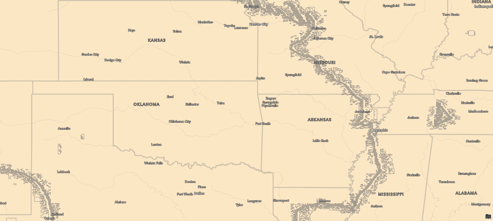
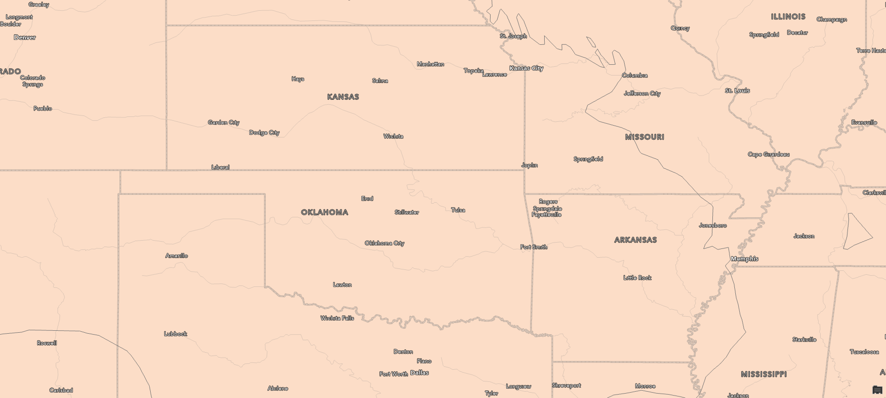

# ArcApple!!
A project for coloring an ArcGIS feature layer based on a raster layer.
## My journey in creating the Bad Apple!! video
1. Created a copy of the Block_Group TIGER shapefile (from the [*National Sub-State Geography Geodatabase* data product](https://www.census.gov/geographies/mapping-files/time-series/geo/tiger-geodatabase-file.2023.html), which only contains Census block groups for the contiguous United States.
   1. This entailed the removal of blocks outside the contiguous U.S. and the removal of blocks where `ALAND = 0` (i.e., blocks with only water bodies)
   2. My final census block group layer was then exported using the "Export Features" geoprocessing tool, which exported the layer into its own geodatabase.
2. Spatially reference [every frame of the Bad Apple!! music video](https://archive.org/details/bad_apple_is.7z) using [world files](https://gavinr.com/georeference-image-extent-arcgis-pro/).
   1. This entailed the calculation of geometry attributes for the most northwest, northeast, southwest, and southeast Census block groups in the contiguous U.S. -- specifically, the "Minimum" and "Maximum x/y-coordinate" attributes, specified in the Calculate Geometry Attributes geoprocessing tool.
   2. The min/max x/y coordinates in the contiguous U.S. were found to be the following, according to the Census block group boundaries:
         ```
         XMAX = -66.925986
         XMIN = -124.772692
         YMAX = 49.384479
         YMIN = 24.476981
         ```
   3. These coordinate values were then used for the following world file:
         ```
         0.04017132361
         0
         0
         -0.02306249815
         -124.772692
         49.384479
         ```
   4. This world file was then duplicated for the entire Bad Apple!! frame dataset (i.e., that text was written out to files with `bad_apple_(X)XXX.pngw` filenames).
      1. This was performed using the Python script `write_world_files.py`, found under `scripts/`.
3. ~~Use a strategy such as creating a [tile index](https://gis.stackexchange.com/questions/229133/how-to-select-the-polygons-based-on-a-raster) to select and color specific polygons by location/overlap with the tiles.~~
   Convert the raster images to vectors/polygons.
   1. We could use the "Raster to Polygon" geoprocessing tool -- however, we need to prepare the images first.
      1. The best method we can use here is to convert the image to a binary image -- keeping the antialiasing on here can lead to a really messy polygon output.
      
      2. This can be done using the simple `THRESH_BINARY` threshold [method in the OpenCV Python package.](https://docs.opencv.org/4.x/d7/d4d/tutorial_py_thresholding.html)
         1. This process was tested at first on one file using `scripts/aliasing.py`, which yielded a phenomenal result.
         
      3. As such, this processing was then performed on every single frame of Bad Apple!! using the `scripts/threshold_images.py` Python script.
   2. After processing the images, they can be convered to polygons using the following structure (in this example, the file `bad_apple_233.png` -- accessible from within the ArcGIS Pro project -- is being converted to a polygon layer named `ba0233` in the `Default.gdb` geodatabase).
   ```py
      arcpy.conversion.RasterToPolygon(
       in_raster="bad_apple_233.png",
       out_polygon_features=r"C:\Users\rodri\OneDrive\Development\ArcApple\arcgis\Default.gdb\ba0233",
       simplify="SIMPLIFY",
       raster_field="Value",
       create_multipart_features="SINGLE_OUTER_PART",
       max_vertices_per_feature=None
      )
   ```
# TODO: remove the ba0233 layer's symbology before doing any screenshot work.
4. Use selections to select and stylize specific polygons, based on the shape of the Bad Apple!! frame polygon.
   1. I'm able to do this with the ArcPy function `SelectLayerByAttribute`. The `gridcode` in `where_clause` specifies that the polygons that correspond to the color black (0 on the binary image) should be selected.
      ```py
      arcpy.management.SelectLayerByAttribute(
       in_layer_or_view="ba0233",
       selection_type="NEW_SELECTION",
       where_clause="gridcode = 0",
       invert_where_clause=None
      )
      ```
   2. Next, the `SelectLayerByLocation` function can be used towards the Census block group layer -- `ContiguousUnitedStates` in this code snipper -- to select census blocks that fall inside the selected Bad Apple polygons.
      ```py
      selectedCensusBlockGroups = arcpy.management.SelectLayerByLocation(
       in_layer="ContiguousUnitedStates",
       overlap_type="WITHIN",
       select_features="ba0233",
       search_distance=None,
       selection_type="NEW_SELECTION",
       invert_spatial_relationship="NOT_INVERT"
      )
      ```
   3. Finally, these selected census block groups can be split off into their own feature layer using the ArcGIS option "Make Layer from Selected Features".
      However, its corresponding ArcPy function does not honor the selected elements, so we have to resort to getting all the object IDs from the selected
      input, and making a feature layer from there. This solution was thankfully [provided by Joshua Sharp-Heward on the Esri community forum](https://community.esri.com/t5/arcgis-pro-questions/make-layer-from-selected-features-using-arcpy/td-p/1276070).
      ```py
      outputLayer = "TestSelection"
      objIds = arcpy.Describe(selectedCensusBlockGroups).FIDSet
      objIdsSql = "OBJECTID IN ({})".format(objIds.replace("; ", ","))
      arcpy.management.MakeFeatureLayer(
        in_features=selectedCensusBlockGroups,
        out_layer=outputLayer,
        where_clause=objIdsSql
      )
      ```
      > A quick note here is that, up to this point, I had not thought about the processing time here. However, in comparing the overlap types
      for selecting the census block groups, I found that there were several hours' worth of difference in processing time. As such, this led
      me to select the "within" overlap type (rather than the faster but less satisfactory "intersect" or the slower but more aesthetically pleasing "have their center in").
      In addition, this has led me to take an approach where I captured the frames for the video at the same time that I created its layer on ArcGIS Pro,
      rather than capturing them after.
   4. Lastly, the output layer can be styled to black by getting ahold of the layer object from the active map, like so:
      ```py
      aprx = arcpy.mp.ArcGISProject("CURRENT")
      currentLayer = aprx.activeMap.listLayers(outputLayer)[0]
      sym = currentLayer.symbology
      sym.renderer.symbol.color = {"RGB": [0, 0, 0, 255]}
      currentLayer.symbology = sym
      ```
5. It is possible to now place the map inside a layout, and export it using the following code:
   > Note: layout resolution is specified in dpi. A resolution of 128 means that the resolution is 3413 x 1920. This means that 1920 x 1080 is attainable with a dpi of 72.
   ```py
    curLayout = aprx.listLayouts()[0]
    curLayout.exportToPNG("layout.png", resolution=128)
   ```